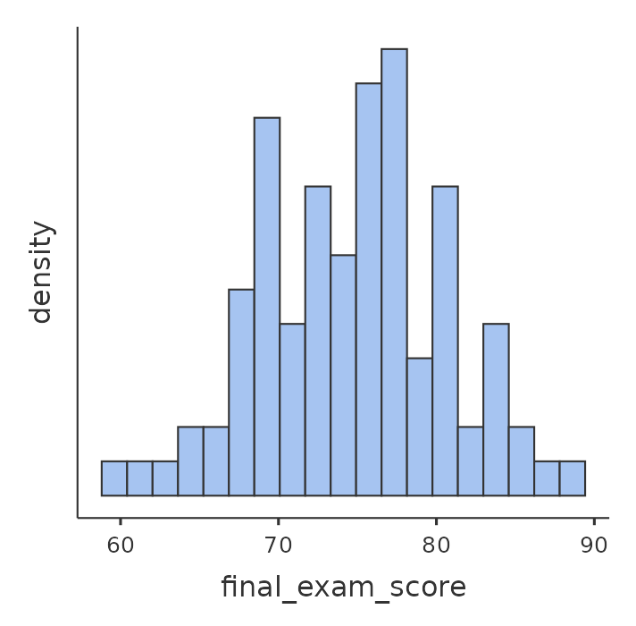
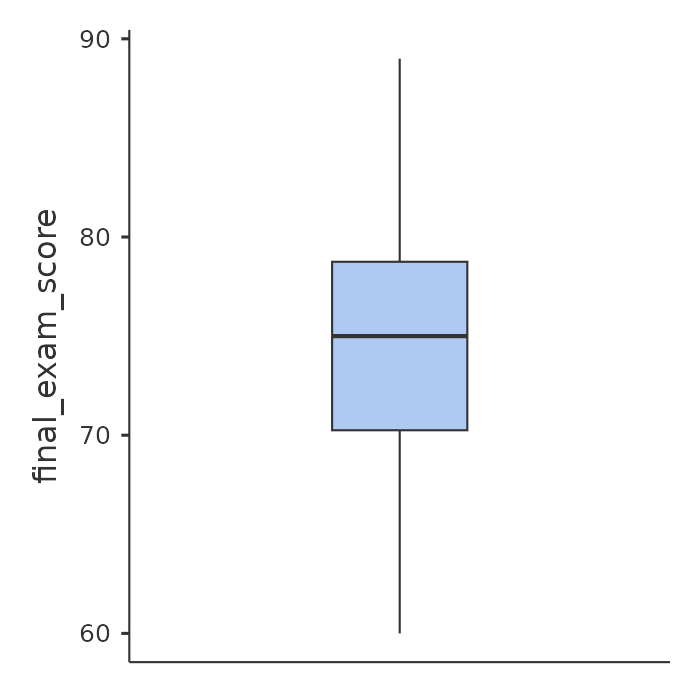

# Summarising Data

This guide will use the main data file and explore the following topics using statistical software:

- Analysing Numerical Data
- Analysing Categorical Data
- Analysing Numerical Data by Different Groups

This guide will walk you through the process of obtaining summary statistics and creating relevant graphs for different types of variables using selected statistical software. Understanding descriptive statistics is a foundational skill in data analysis, providing essential insights into the characteristics of your dataset.

Descriptive statistics help us understand the basic features of the data in a study. They provide simple summaries about the sample and the measures, forming the basis of virtually every quantitative analysis.

Before you begin, ensure you have your `omni` file open in your software. Throughout this guide, we will use specific variables from your dataset to illustrate the concepts, namely:
- `final_exam_score`: Represents the numerical score achieved by students on a final exam.
- `study_hours_per_week`: Indicates the number of hours a student reported studying each week.
- `preferred_study_method`: Describes a student's chosen study strategy (e.g., 'Summarizing', 'Practice Tests', 'Flashcards').
- `study_session_group`: A categorical variable indicating the type of study session group a student was assigned to (e.g., 'High', 'Medium', 'Low').
- `used_study_support_services`: A categorical variable indicating whether a student utilized study support services (Yes/No). This variable will be used to demonstrate splitting analyses by groups.

## Part 1: Analyzing Interval/Ratio Variables

Interval/ratio variables are numerical variables where the differences between values are meaningful. For example, a 10-point difference in exam scores means the same regardless of the score range. Ratio variables also have a true zero point (e.g., age, income, test scores, study hours), where zero indicates an absence of the quantity. For these types of variables, we typically examine measures of central tendency (mean, median, mode) and dispersion (standard deviation, variance, range).

### 1.1 Obtaining Summary Statistics for Interval/Ratio Variables (e.g., final_exam_score)

<button class="collapsible">jamovi Guide</button>

1. Open the `omni.csv` file in jamovi
2. In the jamovi ribbon at the top, click on the <code>Analyses</code> tab
3. Go to <code>Exploration</code> and select <code>Descriptives</code>.
4. A new window will appear. On the left, you'll see a list of all variables in your dataset. Find <code>final_exam_score</code> and move it to the <code>Variables</code> box on the right using the arrow button.
5. Under the <code>Statistics</code> section (usually open by default or can be expanded), ensure the following checkboxes are selected:
    - `N` (Number of valid cases)
    - `Missing` (Number of missing values)
    - `Mean`
    - `Median`
    - `Standard deviation`
    - `Minimum`
    - `Maximum`
    - `Skewness`
    - `Kurtosis`

As you select these options, jamovi will automatically generate the results table in the output panel on the right.
                 

<button class="collapsible">R Studio Guide</button>

Before you begin, ensure you have your <code>omni.csv</code> file available. You can enter commands directly into the R Console (the bottom-left pane in R Studio by default) or by creating an R Script file (<code>File > New File > R Script</code>). Using an R Script file is recommended for saving your commands and making your work reproducible.

In the code examples below, lines starting with `#` are comments. These are notes within the code that explain what the commands are doing. They are very useful for keeping track of your analysis steps in an R Script. If you are entering commands directly into the R Console, you do not need to copy the # or the comments after it.

First, we need to load the data. We will use the `readr` package for this, which is part of the `tidyverse` collection of packages. If you don't have `readr` installed, you'll need to install it first. You only need to install a package once per R installation.

Before loading your data, ensure your `omni.csv` file is in your R working directory. You can set your working directory using the R Studio menu: <code>Session > Set Working Directory > Choose Directory...</code>

<pre><code>install.packages("readr") # Install readr package (only run once if not already installed)

library(readr) # Load readr package (run this line every time you start a new R session and want to use readr)

omni_data &lt;- read_csv("omni.csv") # This command reads the CSV file named "omni.csv" and stores it as a data frame called 'omni_data'.
                                 # The 'read_csv()' function is from the 'readr' package.
</code></pre>

Your data is now loaded into R and will be called `omni_data` (it was the name assigned to the left of the `<-` before the `read_csv` command). You will use `omni_data` to refer to your dataset in the commands.

You can obtain individual descriptive statistics using base R functions, or get a comprehensive summary using the `psych` package.

<ol>
<li><strong>Using Base R Functions (Individual Statistics):</strong>

To get basic statistics like mean and standard deviation for a variable like <code>final_exam_score</code>, you can use individual R functions. The <code>$</code> operator is used to select a specific column (variable) from a data frame.

<pre><code>mean(omni_data$final_exam_score, na.rm = TRUE) # Calculates the mean, ignoring missing values
sd(omni_data$final_exam_score, na.rm = TRUE)   # Calculates the standard deviation, ignoring missing values
median(omni_data$final_exam_score, na.rm = TRUE) # Calculates the median, ignoring missing values
min(omni_data$final_exam_score, na.rm = TRUE)   # Finds the minimum value
max(omni_data$final_exam_score, na.rm = TRUE)   # Finds the maximum value
range(omni_data$final_exam_score, na.rm = TRUE) # Finds the range (min and max)

</code></pre>
                
The <code>na.rm = TRUE</code> argument is important as it tells R to remove any missing values (<code>NA</code>) before performing the calculation. If you don't include this, and your data has missing values, the result will often be <code>NA</code>.

            </li>
            <li><strong>Using the `psych` Package (Comprehensive Summary):</strong>
                
For a more comprehensive set of descriptive statistics, including N, mean, standard deviation, median, minimum, maximum, skewness, and kurtosis, we recommend using the <code>describe()</code> function from the <code>psych</code> package. If you don't have <code>psych</code> installed, you'll need to install it first.

                <pre><code>install.packages("psych") # Install psych package (only run once if not already installed)

library(psych) # Load psych package (run this line every time you start a new R session)

describe(omni_data$final_exam_score) # Get descriptive statistics for 'final_exam_score'
</code></pre>
                
This command will output a table containing various descriptive statistics for the <code>final_exam_score</code> variable. The <code>describe()</code> function is particularly useful as it provides many common statistics in a single output.

            </li>
        </ol>

<button class="collapsible">SPSS Guide</button>

1.  In the SPSS menu, click on `Analyze`, then go to `Descriptive Statistics`, and select `Frequencies...`.
2.  A new dialog box will appear. On the left, you'll see a list of all variables in your dataset. Find `final_exam_score` and move it to the `Variable(s)` box on the right using the arrow button.
3.  Ensure the checkbox for `Display frequency tables` is unchecked (as we are focusing on descriptive statistics for interval/ratio data here).
4.  Click the `Statistics...` button.
5.  In the "Frequencies: Statistics" dialog box, select the following checkboxes:
    *   Under "Central Tendency": `Mean`, `Median`, `Mode`
    *   Under "Dispersion": `Std. deviation`, `Variance`, `Minimum`, `Maximum`
    *   Under "Distribution": `Skewness`, `Kurtosis`
6.  Click `Continue` to close the Statistics dialog box, then click `OK` in the main Frequencies dialog box. SPSS will generate the descriptive statistics table in the Output Viewer.

### 1.2 Interpreting Summary Statistics for Interval/Ratio Variables

Here is what each statistic is telling you:

<ul>
            <li><strong>N &amp; Missing:</strong> The total number of valid observations (N) and the count of any missing data points for this variable.</li>
            <li><strong>Mean:</strong> The arithmetic average of all values. It is calculated by summing all values and dividing by the number of observations. The mean is sensitive to extreme values (outliers), meaning it can be pulled towards very high or very low scores.</li>
            <li><strong>Median:</strong> The middle value when data is ordered from smallest to largest. If there's an even number of observations, it's the average of the two middle values. The median is less affected by outliers than the mean, making it a good measure of typical value in skewed distributions.</li>
            <li><strong>Standard Deviation:</strong> A measure of the typical distance data points are from the mean. A smaller standard deviation indicates data points are clustered closely around the mean, while a larger one indicates more spread or variability in the data.</li>
            <li><strong>Minimum &amp; Maximum:</strong> The smallest and largest values observed in your dataset for that variable. This gives you the range of your data.</li>
            <li><strong>Skewness:</strong> Indicates the symmetry of the distribution.
                <ul>
                    <li>If <strong>Skewness is close to 0</strong>, the distribution is relatively symmetrical (e.g., a bell curve). In symmetrical distributions, the mean, median, and mode are often very close to each other.</li>
                    <li>If <strong>Skewness is positive (>0)</strong>, the tail of the distribution extends to the right (positive direction). This typically means there are more lower values, with a few higher, extreme values pulling the mean to the right of the median. In this case, the Mean > Median.</li>
                    <li>If <strong>Skewness is negative (<0)</strong>, the tail extends to the left (negative direction). This typically means there are more higher values, with a few lower, extreme values pulling the mean to the left of the median. In this case, the Mean < Median.</li>
                </ul>
            </li>
            <li><strong>Kurtosis:</strong> Indicates the "tailedness" or peakedness of the distribution compared to a normal distribution.
                <ul>
                    <li>If <strong>Kurtosis is positive (>0)</strong> (leptokurtic), it suggests heavier tails and a more peaked distribution, potentially indicating more outliers (extreme values).</li>
                    <li>If <strong>Kurtosis is negative (<0)</strong> (platykurtic), it suggests lighter tails and a flatter distribution, with fewer extreme values than a normal distribution.</li>
                    <li>If <strong>Kurtosis is close to 0</strong> (mesokurtic), it resembles the tailedness and peakedness of a normal distribution.</li>
                </ul>
            </li>
        </ul>

Note: Different statistical software or R packages may use slightly different computational algorithms or default settings for calculating skewness and kurtosis. This can lead to minor variations in the reported numerical values, but the general interpretation of the shape (e.g., positive skew, platykurtic) remains consistent.

You should find your statistics resemble these below, for final examination score:

<table aria-label="Summary statistics for final exmination score">
<thead>
<tr>
<th scope="col">Statistic</th>
<th scope="col">Value</th>
</tr>
</thead>
<tbody>
<tr>
<td>Number</td>
<td>94</td>
</tr>
<tr>
<td>Missing</td>
<td>0</td>
</tr>
<tr>
<td>Mean</td>
<td>74.8</td>
</tr>
<tr>
<td>Median</td>
<td>75</td>
</tr>
<tr>
<td>Standard Deviation</td>
<td>5.90</td>
</tr>
</tbody>
</table>
    

### 1.3 Creating Graphs for Interval/Ratio Variables (Histograms & Box Plots)

Graphs provide powerful visual insights into the distribution of your data, complementing the numerical summaries.

<button class="collapsible">jamovi Guide</button>

<ol>
            <li>Continuing from the <code>Descriptives</code> analysis window, look for the <code>Plots</code> section.</li>
            <li>Select <code>Histogram</code> and <code>Box plot</code>.</li>
            <li>Jamovi will automatically update the output panel with these plots.
            </li>
        </ol>

<button class="collapsible">R Studio Guide</button>

<ol>
<li><strong>For Histograms:</strong>
                
Use the <code>hist()</code> function. This function creates a histogram of the specified numerical vector.
                <ul>
                    <li><code>main = "Histogram of Final Exam Scores"</code>: This argument sets the main title of the plot.</li>
                    <li><code>xlab = "Final Exam Score"</code>: This argument sets the label for the x-axis.</li>
                    <li><code>col = "lightblue"</code>: This argument sets the fill colour of the histogram bars.</li>
                    <li><code>border = "black"</code>: This argument sets the colour of the borders around the histogram bars.</li>
                </ul>
                

                <pre><code>hist(omni_data$final_exam_score,
     main = "Histogram of Final Exam Scores",
     xlab = "Final Exam Score",
     col = "lightblue",
     border = "black")</code></pre>
            </li>
            <li><strong>For Box Plots:</strong>
                
Use the <code>boxplot()</code> function. This function creates a box and whisker plot for the specified numerical vector.
                <ul>
                    <li><code>main = "Box Plot of Final Exam Scores"</code>: This argument sets the main title of the plot.</li>
                    <li><code>ylab = "Final Exam Score"</code>: This argument sets the label for the y-axis.</li>
                    <li><code>col = "lightgreen"</code>: This argument sets the fill colour of the box plot.</li>
                </ul>
                

                <pre><code>boxplot(omni_data$final_exam_score,
        main = "Box Plot of Final Exam Scores",
        ylab = "Final Exam Score",
        col = "lightgreen")</code></pre>
            </li>
        </ol>

<button class="collapsible">SPSS Guide</button>

1.  **For Histograms:**
    *   In the `Frequencies` dialog box (where you obtained descriptive statistics in 1.1), click the `Charts...` button.
    *   In the "Frequencies: Charts" dialog box, select `Histograms`.
    *   Optionally, check `Show normal curve on histogram` for comparison.
    *   Click `Continue`, then `OK` in the main Frequencies dialog box.
2.  **For Box Plots:**
    *   In the SPSS menu, click on `Graphs`, then go to `Legacy Dialogs`, and select `Boxplot...`.
    *   In the "Boxplot" dialog box, choose `Simple` and ensure `Summaries of separate variables` is selected. Click `Define`.
    *   Move `final_exam_score` to the `Boxes Represent:` box.
    *   Click `OK`. SPSS will generate the box plot in the Output Viewer.

### 1.4 Interpreting Graphs for Interval/Ratio Variables

<ul>
            <li><strong>Histogram:</strong> Displays the shape of the distribution, showing where values are concentrated, identifying peaks (modes), gaps, and overall symmetry or skewness. Each bar represents a range of values (or "bin"), and its height shows the frequency of scores within that range.</li>
            <li><strong>Box Plot:</strong> Provides a clear visual representation of the "five-number summary": minimum, first quartile (Q1), median (Q2), third quartile (Q3), and maximum. It is particularly effective for identifying outliers.
                <ul>
                    <li>The box itself represents the <strong>Interquartile Range (IQR)</strong>, which contains the middle 50% of your data (between Q1 and Q3).</li>
                    <li>The line inside the box is the <strong>median</strong>.</li>
                    <li>The "whiskers" typically extend to the most extreme data points within 1.5 times the IQR from the box.</li>
                    <li>Individual points (often shown as dots or asterisks) beyond the whiskers are considered <strong>outliers</strong>, specifically those falling more than 1.5 times the IQR below Q1 or above Q3. These points represent values unusually far from the rest of the data.</li>
                </ul>
            </li>
        </ul>

The graphs below are taken from the jamovi software package.  Your results should look similar

  

    
  

  

    
  

#### Reflection Questions & Tasks:

<ol>
                <li>For the final exam scores, compare the Mean (74.8) and Median (75). Based on the explanation of skewness in Section 1.2, what does the relationship between these two values suggest about the symmetry of the final exam score distribution?</li>
                <li>Consider the Skewness value (-0.03) and Kurtosis value (-0.22) for the final exam scores. How do these numerical values, along with the visual information from the histogram, help you describe the overall shape of this distribution? Is it symmetrical, and does it appear peaked or relatively flat compared to a typical bell curve?</li>
                <li>Examine the box plot for the final exam scores. Do you see any individual points plotted outside the main "whiskers" of the box plot? If so, what do these points represent in the context of our data?</li>
                <li><strong>Task:</strong> Now, apply the steps from Sections 1.1 to 1.4 to the variable `study_hours_per_week` in your jamovi file. What are its mean, median, and standard deviation?</li>
            </ol>

<button class="collapsible">Suggested Solutions</button>

<ol>
                <li>For the final exam scores, the Mean (74.8) and Median (75) are very close. This indicates that the distribution of final exam scores is quite <strong>symmetrical</strong>, as neither the mean nor the median is significantly pulled in one direction by extreme values.</li>
                <li>The Skewness value of -0.03 suggests that the distribution of final exam scores is very symmetrical. A Kurtosis value of -0.22, which is close to 0 but slightly negative, indicates that the distribution is slightly <strong>platykurtic</strong> (a bit flatter than a normal distribution), meaning it has slightly lighter tails and fewer extreme values. The histogram should visually confirm this: a roughly bell-shaped curve with no pronounced long tail on either side.</li>
                <li>For the final exam scores, the box plot <strong>does show one individual point</strong> beyond the top whisker. This signifies that there is one statistical <strong>outlier</strong> detected in this dataset for final exam scores, based on the 1.5 IQR rule. This point represents an unusually high score compared to the majority of the data.</li>
                <li><strong>Task Solution (for <code>study_hours_per_week</code>):</strong>
                    <ul>
                        <li><strong>N:</strong> 94</li>
                        <li><strong>Mean:</strong> 19.2</li>
                        <li><strong>Median:</strong> 18.3</li>
                        <li><strong>Standard Deviation:</strong> 7.39</li>
                        <li><strong>Minimum:</strong> 0.0</li>
                        <li><strong>Maximum:</strong> 40.0</li>
                        <li><strong>Skewness:</strong> 0.314 (Slightly positively skewed - the tail extends slightly to the right, meaning a few students study a lot more hours).</li>
                        <li><strong>Kurtosis:</strong> 0.008 (Very slightly leptokurtic, near normal peakedness, suggesting the tails are not excessively heavy or light).</li>
                    </ul>
                </li>
            </ol>
        

### Write-Up Template for Interval/Ratio Variable (Example)

To describe the distribution of final exam scores, descriptive statistics were computed. The sample consisted of N = 94 participants. The mean final exam score was 74.8 (SD = 5.90), with scores ranging from a minimum of 60 to a maximum of 89. The median score was 75.00. The distribution of final exam scores appeared highly symmetrical with a slightly light-tailed distribution, as indicated by the skewness (-0.03) and kurtosis (-0.22) values, respectively. A histogram and box plot further illustrate these characteristics.

## Part 2: Analyzing Categorical Variables

Categorical variables represent types of data which can be divided into groups or categories. This includes nominal variables (categories without inherent order, e.g., 'preferred study method', where 'Flashcards' is not "better" or "more" than 'Summarizing') and ordinal variables (categories with a meaningful order, e.g., satisfaction ratings like 'Low', 'Medium', 'High'). For categorical variables, we focus on frequencies and proportions rather than means and standard deviations, as these mathematical operations are not meaningful for non-numerical categories.

### 2.1 Obtaining Frequency Tables for Categorical Variables (e.g., preferred_study_method)

<button class="collapsible">jamovi Guide</button>

1.  In the jamovi ribbon, click on the `Analyses` tab.
2.  Go to `Exploration` and select `Descriptives`.
3.  A new window will appear. On the left, find your categorical variable (e.g., `preferred_study_method`) and move it to the `Variables` box on the right using the arrow button.
4.  Check the `Frequency tables` box. You will see columns for "Count" and "Percent" appear in the output panel.

<button class="collapsible">R Studio Guide</button>

1.  To get a frequency table for a categorical variable like `preferred_study_method`, use the `table()` function. This will give you the counts for each category.

    <pre><code>table(omni_data$preferred_study_method)</code></pre>

2.  To get percentages (proportions), you can use the `prop.table()` function on the result of `table()`. Multiplying by 100 gives percentages.

    <pre><code>prop.table(table(omni_data$preferred_study_method)) * 100</code></pre>

These commands will output the counts and percentages for each category of the \`preferred\_study\_method\` variable, respectively. These are the standard ways to display frequency distributions for categorical data in R.

<button class="collapsible">SPSS Guide</button>

1.  In the SPSS menu, click on `Analyze`, then go to `Descriptive Statistics`, and select `Frequencies...`.
2.  In the "Frequencies" dialog box, click the `Reset` button to clear any previous selections.
3.  A new dialog box will appear. On the left, find your categorical variable (e.g., `preferred_study_method`) and move it to the `Variable(s)` box on the right using the arrow button.
4.  Ensure the checkbox for `Display frequency tables` is checked.
5.  Click `OK`. SPSS will generate the frequency table in the Output Viewer.

### 2.2 Interpreting Frequency Tables for Categorical Variables

A frequency table lists each category of your variable and shows how many times it appears in your data (Count or Frequency) and its proportion relative to the total (Percent or Percentage).

<table aria-label="Frequency table for preferred study method">
<thead>
                <tr>
                    <th>Preferred Study Method</th>
                    <th>Count</th>
                    <th>% of Total</th>
                </tr>
            </thead>
            <tbody>
                <tr>
                    <td>Flashcards</td>
                    <td>34</td>
                    <td>36.2%</td>
                </tr>
                <tr>
                    <td>Practice Tests</td>
                    <td>29</td>
                    <td>30.9%</td>
                </tr>
                <tr>
                    <td>Summarizing</td>
                    <td>31</td>
                    <td>33.0%</td>
                </tr>
            </tbody>
        </table>

*   **Count:** The number of participants who selected or fall into each specific category.
*   **%:** The percentage of participants in each category out of the total valid cases (excluding missing values).
*   Note: "Cumulative %" is sometimes shown for ordinal data (where categories have an order), but it is generally less meaningful for nominal data where there is no inherent order.

### 2.3 Creating Graphs for Categorical Variables (Bar Charts)

Graphs provide powerful visual insights into the distribution of your data, complementing the numerical summaries.

<button class="collapsible">jamovi Guide</button>

1.  Continuing from the `Descriptives` analysis window, look for the `Plots` section.
2.  Select `Bar plot`.
3.  Jamovi will instantly update the output panel with this plot.
    

<button class="collapsible">R Studio Guide</button>

To create a bar chart for a categorical variable like <code>preferred_study_method</code>, first create a frequency table using <code>table()</code>, and then pass this table to the <code>barplot()</code> function.

Use the <code>barplot()</code> function. This function creates a bar plot of the specified data (typically a frequency table).

   <pre><code>method_counts <- table(omni_data$preferred_study_method) # Create a frequency table

barplot(method_counts,
       main = "Bar Chart of Preferred Study Methods", # Title of the bar chart
       xlab = "Study Method",                       # Label for the x-axis
       ylab = "Frequency",                          # Label for the y-axis
       col = c("coral", "lightgreen", "skyblue"),   # Colours for the bars
       border = "black")                            # Border colour of the bars</code></pre>

<ul>
   <li><code>method_counts <- table(omni_data$preferred_study_method)</code>: This line first creates a frequency table of the `preferred_study_method` variable and stores it in an object called `method_counts`. This table is then passed to the `barplot()` function.</li>
   <li><code>main = "Bar Chart of Preferred Study Methods"</code>: This argument sets the main title of the plot.</li>
   <li><code>xlab = "Study Method"</code>: This argument sets the label for the x-axis.</li>
   <li><code>ylab = "Frequency"</code>: This argument sets the label for the y-axis.</li>
   <li><code>col = c("coral", "lightgreen", "skyblue")</code>: This argument sets the fill colours for the bars. You can provide a vector of colours to assign a different colour to each bar.</li>
   <li><code>border = "black"</code>: This argument sets the colour of the borders around the bars.</li>
 </ul>
  

<button class="collapsible">SPSS Guide</button>

1.  In the `Frequencies` dialog box (where you obtained frequency tables in 2.1), click the `Charts...` button.
2.  In the "Frequencies: Charts" dialog box, select `Bar charts`.
3.  Ensure `Frequencies` is selected under `Chart Values`.
4.  Click `Continue`, then `OK` in the main Frequencies dialog box. SPSS will generate the bar chart in the Output Viewer.

### 2.4 Interpreting Graphs for Categorical Variables

*   **Bar Chart:** Each bar represents a distinct category, and its height (or length) corresponds to the frequency or percentage of observations in that category. Bar charts are generally preferred over pie charts for clarity and ease of comparison, especially when comparing frequencies across multiple categories or when categories have similar proportions.

#### Reflection Questions & Tasks:

1.  Based on the frequency table for 'preferred study method', identify the study method that was most frequently reported. What was its exact count and percentage of the total sample?
2.  Why do we use counts and percentages (frequency tables and bar charts) for a variable like 'preferred study method', but avoid calculating a "mean" or "standard deviation"? Consider the nature of this variable.
3.  **Task:** Apply the steps from Sections 2.1 to 2.4 to the categorical variable `study_session_group`. Obtain its frequency table and plots.

<button class="collapsible">Suggested Solutions</button>

1.  For 'preferred study method', "Flashcards" was the most frequently reported method, with a **Count of 34** participants, representing **36.2%** of the total sample.
2.  We avoid calculating a "mean" or "standard deviation" for 'preferred study method' because it is a **nominal categorical variable**. Its categories ("Flashcards", "Summarizing", "Practice Tests") are simply labels; they do not represent quantities or have a numerical order. Therefore, performing mathematical operations like averaging these categories would be meaningless and illogical. Mean and standard deviation are statistics designed for numerical data.
3.  **Task Solution (for `study_session_group`):**
    *   **Low:** Count = 28, Percent = 29.8%
    *   **Medium:** Count = 36, Percent = 38.3%
    *   **High:** Count = 30, Percent = 31.9%

## Part 3: Descriptive Statistics by Groups (Splitting Data by Factors)

In data analysis, it is often insightful to understand if a numerical variable's distribution differs across distinct categories of another variable. This is known as "splitting" or "grouping" your data. For example, we might want to see if the final exam scores vary between students who used study support services and those who did not.

### 3.1 Analyzing Interval/Ratio Variable by a Categorical Factor (e.g., final exam scores by used\_study\_support\_services)

<button class="collapsible">jamovi Guide</button>

1.  Return to the `Analyses` tab, then `Exploration` > `Descriptives`.
2.  Move `final_exam_score` to the `Variables` box.
3.  Now, find the categorical variable `used_study_support_services` and move it to the `Split By` box. This action tells jamovi to calculate descriptive statistics for final exam scores separately for each group (i.e., 'Yes' and 'No' groups) within `used_study_support_services`.
4.  Ensure that all relevant statistics (Mean, Median, Std Dev, Min, Max, Skewness, Kurtosis) are selected under the `Statistics` panel, and both `Histogram` and `Box plot` are selected under the `Plots` panel.
    
    You will now observe jamovi generating separate results tables and plots for the 'No' and 'Yes' categories of `used_study_support_services` in your output panel.

<button class="collapsible">R Studio Guide</button>

To obtain descriptive statistics for a numerical variable, grouped by a categorical variable, you have two main approaches: using the `describeBy()` function from the `psych` package (simpler for direct summaries) or using the `dplyr` package with its powerful piping capabilities (more flexible for custom summaries and data manipulation).

#### Method 1: Using \`psych::describeBy()\`

The `describeBy()` function from the `psych` package is specifically designed for this type of grouped analysis and provides a comprehensive set of statistics for each group in a single step.

Use the `describeBy()` function with the following arguments:

<pre><code>
describeBy(x = omni_data$final_exam_score,
  group = omni_data$used_study_support_services,
  mat = TRUE,
  digits = 2)
</code></pre>

*   `x`: This is the numerical variable you want to describe (e.g., `omni_data$final_exam_score`).
*   `group`: This is the categorical variable by which you want to split or group your data (e.g., `omni_data$used_study_support_services`).
*   `mat = TRUE`: This argument ensures the output is presented in a matrix (table) format, which is typically easier to read and interpret.
*   `digits = 2`: This argument rounds the numerical output to 2 decimal places for cleaner presentation.
    

This command will produce a table showing the descriptive statistics (mean, median, SD, skew, kurtosis, etc.) for `final_exam_score` separately for each level of `used_study_support_services` ('No' and 'Yes').

#### Method 2: Using \`dplyr\` (Flexible for Custom Summaries)

The `dplyr` package (part of the `tidyverse`) is a powerful tool for data manipulation in R. It uses a concept called "piping" (`%>%`), which allows you to chain commands together in a very readable and logical flow. It's like saying "take this data, THEN do this, THEN do that." If you don't have `dplyr` installed, you'll need to install it first.

    install.packages("dplyr") # Install dplyr package (only run once if not already installed)
    
    library(dplyr) # Load dplyr package (run this line every time you start a new R session)
    
    omni_data %>%
      group_by(used_study_support_services) %>%
      summarise(
        N = n(),
        Mean = mean(final_exam_score, na.rm = TRUE),
        Median = median(final_exam_score, na.rm = TRUE),
        SD = sd(final_exam_score, na.rm = TRUE),
        Min = min(final_exam_score, na.rm = TRUE),
        Max = max(final_exam_score, na.rm = TRUE),
        Skewness = psych::skew(final_exam_score, na.rm = TRUE),
        Kurtosis = psych::kurtosi(final_exam_score, na.rm = TRUE)
      )
    

Let's break down what each part of this `dplyr` command does:

*   `omni_data %>%`: This starts the "pipe." It takes your `omni_data` data frame and passes it as the first argument to the next function (`group_by()`). The `%>%` operator can be read as "then."
*   `group_by(used_study_support_services)`: This function groups the data by the `used_study_support_services` variable. Any subsequent operations (like `summarise()`) will then be applied separately to each unique category within this grouping variable (e.g., 'Yes' and 'No').
*   `summarise(...)`: This function creates new summary variables (columns) for each group. Inside `summarise()`, you define the new column names and the calculations for them:
    *   `N = n()`: Calculates the number of observations (count) for each group. `n()` is a `dplyr` specific function to get the count.
    *   `Mean = mean(final_exam_score, na.rm = TRUE)`: Calculates the mean of `final_exam_score` for each group, ignoring missing values.
    *   `Median = median(final_exam_score, na.rm = TRUE)`: Calculates the median of `final_exam_score` for each group, ignoring missing values.
    *   `SD = sd(final_exam_score, na.rm = TRUE)`: Calculates the standard deviation of `final_exam_score` for each group, ignoring missing values.
    *   `Min = min(final_exam_score, na.rm = TRUE)`: Finds the minimum value of `final_exam_score` for each group.
    *   `Max = max(final_exam_score, na.rm = TRUE)`: Finds the maximum value of `final_exam_score` for each group.
    *   `Skewness = psych::skew(final_exam_score, na.rm = TRUE)`: Calculates the skewness of `final_exam_score` for each group. Note the `psych::` prefix, which ensures R uses the `skew` function from the `psych` package.
    *   `Kurtosis = psych::kurtosi(final_exam_score, na.rm = TRUE)`: Calculates the kurtosis of `final_exam_score` for each group. Again, `psych::` specifies the package.

When you run this entire block of code, the result will be a table showing the requested summary statistics for `final_exam_score`, broken down by `used_study_support_services`.

#### Creating Grouped Graphs

For creating grouped histograms and box plots, `ggplot2` is highly recommended for its flexibility and aesthetic quality. If you don't have `ggplot2` installed, you'll need to install it first.

**Install and load the `ggplot2` package:**
    
        install.packages("ggplot2") # Install ggplot2 package (only run once if not already installed)
        
        library(ggplot2) # Load ggplot2 package (run this line every time you start a new R session)
    
**For Grouped Histograms:**
    
Use `ggplot2` to create separate histograms for each group.

<pre><code>
    ggplot(omni_data, aes(x = final_exam_score)) +
       geom_histogram(binwidth = 5, fill = "steelblue", colour = "black") +
       facet_wrap(~ used_study_support_services, scales = "free_y") +
       labs(title = "Histograms of Final Exam Scores by Study Support Service Usage",
       x = "Final Exam Score", y = "Frequency") +
       theme_minimal()
</code></pre>
    
*   `ggplot(omni_data, aes(x = final_exam_score))`: This initializes the plot, specifying the data frame (`omni_data`) and mapping `final_exam_score` to the x-axis aesthetic.
*   `geom_histogram(binwidth = 5, fill = "steelblue", colour = "black")`: This layer adds the histogram bars.
*   `binwidth = 5`: Sets the width of each bar (bin) to 5 units.
*   `fill = "steelblue"`: Sets the fill colour of the bars.
*   `colour = "black"`: Sets the outline colour of the bars.
*   `facet_wrap(~ used_study_support_services, scales = "free_y")`: This is key for grouping. It creates separate plots (facets) for each unique value in `used_study_support_services`.
*   `~ used_study_support_services`: Specifies the variable to split the plots by.
*   `scales = "free_y"`: Allows the y-axis (frequency) scale to vary for each plot, which is useful if group sizes differ significantly.
*   `labs(...)`: Adds titles and axis labels.
*   `theme_minimal()`: Applies a minimalist theme for a clean look.
    
    
**For Grouped Box Plots:**
    
Use `ggplot2` for more flexible and aesthetically pleasing grouped box plots.

<pre><code>
ggplot(omni_data, aes(x = used_study_support_services, y = final_exam_score, fill = used_study_support_services)) +
      geom_boxplot() +
      labs(title = "Box Plots of Final Exam Scores by Study Support Service Usage",
       x = "Used Study Support Services", y = "Final Exam Score") +
      theme_minimal() +
      heme(legend.position = "none")
</code></pre>
    
*   `ggplot(omni_data, aes(x = used_study_support_services, y = final_exam_score, fill = used_study_support_services))`: Initializes the plot. Here, `used_study_support_services` is mapped to the x-axis (for grouping), `final_exam_score` to the y-axis, and `fill` aesthetic is also mapped to the grouping variable to colour the boxes.
*   `geom_boxplot()`: Adds the box plot layer.
*   `labs(...)`: Adds titles and axis labels.
*   `theme_minimal()`: Applies a minimalist theme.
*   `theme(legend.position = "none")`: Removes the legend, as the fill colour is already indicated by the x-axis labels.
    

<button class="collapsible">SPSS Guide</button>

1.  In the SPSS menu, click on `Analyze`, then go to `Descriptive Statistics`, and select `Explore...`.
2.  A new dialog box will appear. Move `final_exam_score` to the `Dependent List:` box.
3.  Find the categorical variable `used_study_support_services` and move it to the `Factor List:` box. This action tells SPSS to calculate descriptive statistics for final exam scores separately for each group (i.e., 'Yes' and 'No' groups) within \`used\_study\_support\_services\`.
4.  Click the `Statistics...` button. Ensure `Descriptives` is checked. Click `Continue`.
5.  Click the `Plots...` button.
    *   Under "Boxplots", select `Factor levels together`.
    *   Under "Descriptive", ensure `Histogram` is checked.
    *   Click `Continue`.
6.  In the main "Explore" dialog box, ensure `Both` is selected under `Display`.
7.  Click `OK`. SPSS will generate separate descriptive statistics tables and plots for the 'No' and 'Yes' categories of `used_study_support_services` in your Output Viewer.

### 3.2 Interpreting Grouped Descriptive Statistics

By comparing the statistics and plots for each group, you can identify differences in the central tendency, spread, and shape of the numerical variable's distribution across your defined categories.

*   **Comparison of Means/Medians:** Observe if the average exam scores are different for students who used support services compared to those who did not.
*   **Comparison of Standard Deviations:** Determine if the variability (consistency) in exam scores is different between the two groups. A larger standard deviation suggests more diverse scores within that group.
*   **Comparison of Skewness/Kurtosis:** Analyze if the shapes of the exam score distributions differ between the 'Yes' and 'No' groups (e.g., is one group's scores more skewed or more peaked?).
*   **Box Plots:** Visually compare the median lines, the size of the boxes (IQR), and the presence or absence of outliers between the groups. This provides a quick visual summary of potential group differences.

Selected statistics:

<table aria-label="Summary final examination statistics by study support use">
<thead>
                <tr>
                    <th>Statistic</th>
                    <th>Used Study Support</th>
                    <th>Did Not Use Study Support</th>
                </tr>
            </thead>
            <tbody>
                <tr>
                    <td>N</td>
                    <td>48</td>
                    <td>46</td>
                </tr>
                <tr>
                    <td>Mean</td>
                    <td>77.2</td>
                    <td>72.3</td>
                </tr>
                <tr>
                    <td>Median</td>
                    <td>77</td>
                    <td>71.5</td>
                </tr>
                <tr>
                    <td>SD</td>
                    <td>4.77</td>
                    <td>5.94</td>
                </tr>
            </tbody>
        </table>

#### Reflection Questions & Tasks:

1.  Based on the grouped descriptive statistics for final exam scores when split by `used_study_support_services`, what is the mean final exam score for students who used support services compared to those who did not? What initial conclusion can you draw from this difference?
2.  Examine the standard deviations for both groups: 'Yes' (4.77) and 'No' (5.94). What does this difference imply about the consistency or variability of final exam scores within each group?
3.  Look closely at the grouped histograms or box plots. Do the distributions of final exam scores appear to have similar shapes (e.g., symmetry, spread, presence of outliers) for both groups, or are there noticeable visual differences that stand out?
4.  **Task:** Conduct a similar analysis. Explore the numerical variable `quiz_score_post`, but this time, split it by the categorical variable `attended_peer_study_group`. What patterns do you observe regarding their post-quiz scores?

<button class="collapsible">Suggested Solutions</button>

1.  The mean final exam score for students who used study support services is 77.20, which is higher than the mean of 72.3 for students who did not use support services. This suggests that, in this sample, students who utilized study support services tended to achieve higher final exam scores, on average.
2.  The standard deviation for the 'Yes' group (4.77) is smaller than for the 'No' group (5.94). This implies that final exam scores among students who used study support services were generally **more consistent** (less spread out) compared to those who did not use study support services. The scores in the 'Yes' group were more clustered around their mean.
3.  Visually, the box plots will show that the 'Yes' group's distribution is centered at a higher score and its box (IQR) is narrower, indicating less variability. Both distributions appear relatively symmetrical, with slightly more positive skew in the no group.
4.  **Task Solution (for `quiz_score_post` split by `attended_peer_study_group`):**
    *   **Students who DID NOT attend peer study group ('No' group):** N=46, Mean=73.7, Median=73, SD=8.70, Minimum=50, Maximum=95, Skewness=-0.224, Kurtosis=0.811.
    *   **Students who DID attend peer study group ('Yes' group):** N=48, Mean=68.1, Median=70, SD=10.13, Minimum=49, Maximum=88, Skewness=-0.008, Kurtosis=-0.687.Based on these numbers, students who attended peer study groups ('Yes' group) had a lower mean post-quiz score (68.1) compared to those who did not attend ('No' group, 73.7). The 'Yes' group also shows a larger standard deviation (10.13 vs 8.70), indicating more variability in their post-quiz scores. The no distribution appears slightly negatively skewed. This suggests that in this sample, attending peer study groups did not lead to higher average post-quiz scores and was associated with more varied performance.

#### Write-Up Template for Grouped Interval/Ratio Variable (Example)

To compare final exam performance based on study support service usage, descriptive statistics for final exam scores were computed, split by study support service usage. Students who reported using study support services (N = 48) had a mean final exam score of 77.2 (SD = 4.77), a median of 77.00, and scores ranging from 68 to 87. In contrast, students who did not use study support services (N = 46) had a mean final exam score of 72.3 (SD = 5.94), a median of 71.5, and scores ranging from 60 to 89. This suggests that students utilizing support services achieved, on average, higher and more consistent final exam scores. Further visual inspection of the grouped histograms and box plots provides additional insights into the distributions of scores for both groups. For instance, the 'Yes' group's distribution appears slightly narrower and centered at a higher score, with less variability than the 'No' group. Both distributions were relatively symmetrical, with the 'No' group having a skewness of 0.34 and kurtosis of 0.25, while the 'Yes' group had a skewness of 0.15 and kurtosis = -0.60.

<link rel="stylesheet" href="{{ '/assets/css/twopic.css' | relative_url }}">

